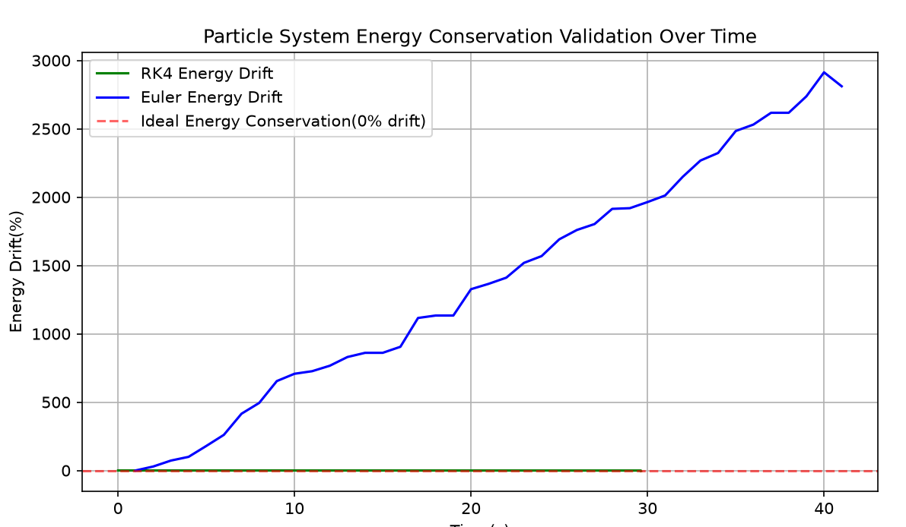

# Unified Multi-Physics Particle System

A C++ simulation modeling gravitational and spring forces on particles in 2D space, with spatial partitioning for efficient collision detection and RK4 numerical integration for physics accuracy. 

---

## Overview

This project simulates a system of 100–1000 particles at 60fps affected by gravity and spring forces, with particle-to-particle and wall collisions. The simulation uses:

- **RK4 integration** for <0.1% energy drift and increase in accuracy compared to Euler integration
- **Spatial partitioning hashmap** to reduce collision detection from O(n²) to O(n)
- **Spring Dampening** to replicate real world conditions

---

## Physics Model

### Forces and Acceleration

**Gravitational Force (freefall)**:

```
a = -g = -9.8 m/s²
```

**Spring Force (when y ≤ spring height)**:

```
F_spring = k(y - h)
a_total = (k/m)(y - h) - g
acceleration is the force of the spring/mass minus gravity

The spring stiffness `k` is scalable as a cmd line parameter but if no arguments are provided it is 
dynamically calculated to support a particle at equilibrium compression (0.2 m) where m is the mass per particle:
k = ( 9.8 × m / 0.2) × 4

Factor of 4 increases springiness and creates a responsive force.
```

### Numerical Integration

**RK4 (Runge-Kutta 4th Order)** with fixed timestep `dt = 0.1 s`. Computes four slope estimates (k1–k4) and combines them with weights (1:2:2:1) to approximate the solution:

```cpp
		// Determine if particle is on spring once at start of step
		bool onSpring = (p.getY() <= s.getHeight());

		// RK4 stages
		double k1y = p.getVy();

		//if it's on the spring change it's accelaration to k*dy/m-(dampening coeffiecient*velo/mass)-g and if not than keep accelaration to -9.8
		double k1v = onSpring ? (s.getK() / p.getMass()) * (s.getHeight() - p.getY()) - (s.getDamp() * k1y) / p.getMass() - 9.8f : -9.8f;

		double k2y = p.getVy() + 0.5f * k1v * dt;
		double k2v = onSpring ? (s.getK() / p.getMass()) * (s.getHeight() - (p.getY() + 0.5f * k1y * dt)) - (s.getDamp() * k2y) / p.getMass() - 9.8f : -9.8f;

		double k3y = p.getVy() + 0.5f * k2v * dt;
		double k3v = onSpring ? (s.getK() / p.getMass()) * (s.getHeight() - (p.getY() + 0.5f * k2y * dt)) - (s.getDamp() * k3y) / p.getMass() - 9.8f : -9.8f;

		double k4y = p.getVy() + k3v * dt;
		double k4v = onSpring ? (s.getK() / p.getMass()) * (s.getHeight() - (p.getY() + k3y * dt)) - (s.getDamp() * k4y) / p.getMass() - 9.8f : -9.8f;

		// Update to a weighted avg of every slope
		p.setY(p.getY() + (dt / 6.0f) * (k1y + 2 * k2y + 2 * k3y + k4y));
		p.setVy(p.getVy() + (dt / 6.0f) * (k1v + 2 * k2v + 2 * k3v + k4v));

```
Updates apply at (`0.01 s` intervals) within each frame for stability. Rk4 achieves <0.1% energy drift over long simulations compared to the approximately 2% drift with Euler integration.

## Program Architecture

### Spatial Partitioning

The simulation uses a dynamically sized to reduce collision detection from O(n²) to O(n) for typical particle distributions:
-**Grid Sizing**: Width and height are the maximum between 3 and  grid(sqrt(num of particles/10)+2)
- **Grid cell width**: 800 / cells per row
- **Collision checks**: Only particles in the same grid cell are tested
- **Grid update**: `fix()` partial rebuild if any particles move cells to update the simulation while managing resources
- **Multiplier**: Creates a unique key using (row*cellsPerGrid)+cell

This optimization scales efficiently to 1000 particles without performance degradation.

### Collision Detection

#### Particle–Particle Collisions
- **Trigger**: Euclidean distance `absDx * absDx + absDy * absDy < 100` units (r^2) (are the particles overlapping?)
- **Axis determination**: Compare `|dx|` vs. `|dy|` to resolve collision along correct axis
	- **Response**:
	  - **Y-axis collision**: Swap vy for energy conservation
	  - **X-axis collision**: Swap vx for energy conservation
	  - **If X and Y axis are equal**: apply Y-axis collision conditions.

#### Wall Collisions
- **Bounds**: `y values are from 6-max height and x values are from 0-max height (non-inclusive)`
- **Response**: Reverse normal velocity component, clamp position to boundary

## CSV Logging
Uses fstream C++ library to create a csv file and log the qualities of every particle (besides mechanical energy and mass (automatically 0.5kg to prevent division by 0 errors) for further analysis.

#### Python CSV Analysis
- **Method**: Reads CSV, computes kinetic, gravitational potential, and potential spring energy. Plots energy drift % over time. Also let's user choose how many particle trajectories they want to view.
- **Result**: RK4 method has <0.1% energy drift and demonstrates numerical stability
- **Energy Conservation**: 
- **Particle Trajectories**: 

## Neighbor Checking
A flaw of the previous versions was that they didn't check if particles in different cells collided with other particles in different cells. The 5.0 versions do.

```
		//loops through the vector of neighbor cell positions
		for (auto &neighborJump : neighbors) {
			//row and col of neighbor cell
			int nRow = row + neighborJump[0];
			int nCol = col + neighborJump[1];

			if (nRow >= 0 && nRow < nBox && nCol >= 0 && nCol < nBox) {
				int neighborkey = nRow * nBox + nCol;


				auto adjCell = grid.find(neighborkey);
				//if the cell isn't the end iterator of the hash map see if the neigbor particles collided with any of the original cell neigbors
				if (adjCell != grid.end()) {
					const auto& neighborParticles = adjCell->second;

					for (auto* ogCellPart : cellParticles) {

						//loop through the neighbors particles
						for (auto* neighborParts : neighborParticles) {

							dy = neighborParts->getY() - ogCellPart->getY();
							dx = neighborParts->getX() - ogCellPart->getX();

							//absolute distance
							double absDx = abs(dx);
							double absDy = abs(dy);

							//if distance^2 is less than the particle radius^2: then they collided. Using squared to budget CPU resources and be accurate at the same time
							if (absDx * absDx + absDy * absDy < 100) {
								// Calculate relative velocity
								double dvx = neighborParts->getVx() - ogCellPart->getVx();
								double dvy = neighborParts->getVy() - ogCellPart->getVy();

								//only swap velo if they are moving towards eachother. Determines if they are pointing to eachother and acts accordingly
								if (dx * dvx + dy * dvy < 0) {
									if (absDx <= absDy) {
										double tempVy = neighborParts->getVy();
										neighborParts->setVy(ogCellPart->getVy());
										ogCellPart->setVy(tempVy);
									}
									else {
										double tempVx = neighborParts->getVx();
										neighborParts->setVx(ogCellPart->getVx());
										ogCellPart->setVx(tempVx);
									}
								}
							}
						}
					}
				}
			}
		}
```

## Spring Dampening
Program Allows User to enter a spring dampening force coefficient (0-0.2)


### Frame Timing

Uses `std::chrono::high_resolution_clock` to decouple frame rate from simulation timestep:
```
accumulator += frameDuration.count()
while (accumulator >= dt) {
    update()
    accumulator -= dt
}
```


Ensures consistent physics independent of frame rate or system load.

## C++ Code Structure

| File | Purpose |
|------|---------|
| `particleSim2.0.cpp` | Initialization, user input validation, grid setup, main loop |
| `Particles.cpp` | Physics update, collision detection, grid management |
| `Particles.h` | Class definitions (`Particles`, `Spring`), function declarations |

### Key Functions

| Function | Signature | Purpose |
|----------|-----------|---------|
| `updatePos()` | `void(vector<Particles>&, Spring&)` | Apply forces, update velocity and position |
| `wallCollis()` | `void(vector<Particles>&)` | Handle boundary collisions |
| `particleCollis()` | `void(std::unordered_map<int, std::vector<Particles*>>&)` | Detect and resolve particle–particle collisions within grid cells with more than 1 particle |
| `fix()` | `void(std::vector<Particles>&, std::unordered_map<int, std::vector<Particles*>>&, int, int)` | Clears and puts any particle that moves cells in accordance to it's current position while maintaining O(1) time|
| `csvDump()` | `void csvDump(std::vector<Particles>&, std::string&);` | Logs particle state into csv file for futher analysis|

```
    while(window.isOpen()){
        while (const auto event = window.pollEvent()) {
            //close the window if the user wants it closed
            if (event->is<sf::Event::Closed>()) {
                window.close();
            }
        }
      //Rest of code
  }

```


#### Requirements
- **C++**: C++11 or later
-**Python**: Python 3.14 or later with `pandas` and `matplotlib`


---

**Date**: September 2026  
**License**: MIT
